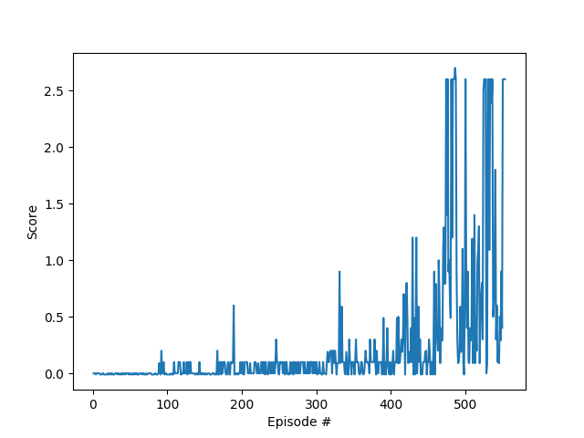

[//]: # (Image References)

[image1]: https://user-images.githubusercontent.com/10624937/42135623-e770e354-7d12-11e8-998d-29fc74429ca2.gif "Trained Agent"
[image2]: https://user-images.githubusercontent.com/10624937/42135622-e55fb586-7d12-11e8-8a54-3c31da15a90a.gif "Soccer"

# Project 3: Collaboration and Competition

![Trained Agent][image1]

## Introduction

In this environment, two agents control rackets to bounce a ball over a net. If an agent hits the ball over the net, it receives a reward of +0.1.  If an agent lets a ball hit the ground or hits the ball out of bounds, it receives a reward of -0.01.  Thus, the goal of each agent is to keep the ball in play.

The observation space consists of 8 variables corresponding to the position and velocity of the ball and racket. Each agent receives its own, local observation.  Two continuous actions are available, corresponding to movement toward (or away from) the net, and jumping.

The task is episodic, and in order to solve the environment, the agents must get an average score of +0.5 (over 100 consecutive episodes, after taking the maximum over both agents). Specifically,

- After each episode, we add up the rewards that each agent received (without discounting), to get a score for each agent. This yields 2 (potentially different) scores. We then take the maximum of these 2 scores.
- This yields a single **score** for each episode.

The environment is considered solved, when the average (over 100 episodes) of those **scores** is at least +0.5. In this solution, a **mean agent score over 100 episodes of > 1.0** was achieved!

## State and action spaces

- Vector Observation space type: continuous
- Vector Observation space size (per agent): 24
- Vector Action space type: continuous
- Vector Action space size (per agent): 2
- Number of agents: 2

## Getting Started

1. For environment setup information, please see [Setup](https://github.com/udacity/deep-reinforcement-learning#dependencies).

2. Download the environment from one of the links below.  You need only select the environment that matches your operating system:
    - Linux: [click here](https://s3-us-west-1.amazonaws.com/udacity-drlnd/P3/Tennis/Tennis_Linux.zip)
    - Mac OSX: [click here](https://s3-us-west-1.amazonaws.com/udacity-drlnd/P3/Tennis/Tennis.app.zip)
    - Windows (32-bit): [click here](https://s3-us-west-1.amazonaws.com/udacity-drlnd/P3/Tennis/Tennis_Windows_x86.zip)
    - Windows (64-bit): [click here](https://s3-us-west-1.amazonaws.com/udacity-drlnd/P3/Tennis/Tennis_Windows_x86_64.zip)

    (_For Windows users_) Check out [this link](https://support.microsoft.com/en-us/help/827218/how-to-determine-whether-a-computer-is-running-a-32-bit-version-or-64) if you need help with determining if your computer is running a 32-bit version or 64-bit version of the Windows operating system.

    (_For AWS_) If you'd like to train the agent on AWS (and have not [enabled a virtual screen](https://github.com/Unity-Technologies/ml-agents/blob/master/docs/Training-on-Amazon-Web-Service.md)), then please use [this link](https://s3-us-west-1.amazonaws.com/udacity-drlnd/P3/Tennis/Tennis_Linux_NoVis.zip) to obtain the "headless" version of the environment.  You will **not** be able to watch the agent without enabling a virtual screen, but you will be able to train the agent.  (_To watch the agent, you should follow the instructions to [enable a virtual screen](https://github.com/Unity-Technologies/ml-agents/blob/master/docs/Training-on-Amazon-Web-Service.md), and then download the environment for the **Linux** operating system above._)

3. Place the file in the repository, in the root dir, and unzip (or decompress) the file.

4. If you have more questions about environment setup, please see [More setup info](https://github.com/udacity/deep-reinforcement-learning/tree/master/p3_collab-compet#getting-started).

5. Remember to activate the drlnd environment before training or running the agent.

6. Unrelated but for other unity environments like this that you can train, please see [Unity Agents](https://github.com/Unity-Technologies/ml-agents/blob/master/docs/Learning-Environment-Examples.md#tennis).

## How to Train

The agent can be trained by running the following (assuming linux)

```sh
$ source activate drlnd
$ python train.py
```

Training progress will be printed during the training and scores will be plotted and saved `score.png` at the end.

You should see a performance curve like this




## How to Run the agent

The agent can be run by the following

```sh
$ source activate drlnd
$ python play.py
```

This will fire up a Unity Environment and run the environment at normal speed suitable for visual verification.

Checkpoints saved earlier will be loaded so that actions can be predicted by the agents.

## Example Training Run

```sh
(drlnd) ~~> ~/code/p3_tennis $ python train.py
Found path: /home/lpadukana/code/p3_tennis/Tennis_Linux/Tennis.x86_64
Mono path[0] = '/home/lpadukana/code/p3_tennis/Tennis_Linux/Tennis_Data/Managed'
Mono config path = '/home/lpadukana/code/p3_tennis/Tennis_Linux/Tennis_Data/MonoBleedingEdge/etc'
Preloaded 'ScreenSelector.so'
Preloaded 'libgrpc_csharp_ext.x64.so'
Unable to preload the following plugins:
	ScreenSelector.so
	libgrpc_csharp_ext.x86.so
Logging to /home/lpadukana/.config/unity3d/Unity Technologies/Unity Environment/Player.log
INFO:unityagents:
'Academy' started successfully!
Unity Academy name: Academy
        Number of Brains: 1
        Number of External Brains : 1
        Lesson number : 0
        Reset Parameters :

Unity brain name: TennisBrain
        Number of Visual Observations (per agent): 0
        Vector Observation space type: continuous
        Vector Observation space size (per agent): 8
        Number of stacked Vector Observation: 3
        Vector Action space type: continuous
        Vector Action space size (per agent): 2
        Vector Action descriptions: ,
2 24 2
Episode 0	 mean-score-1: 0.000 mean-score-2: -0.010 mean-score: -0.005
Saving checkpoints...
Episode 1	 mean-score-1: 0.000 mean-score-2: -0.015 mean-score: -0.007
Episode 2	 mean-score-1: 0.000 mean-score-2: -0.013 mean-score: -0.007
Episode 3	 mean-score-1: -0.002 mean-score-2: -0.010 mean-score: -0.006
Episode 4	 mean-score-1: -0.002 mean-score-2: -0.010 mean-score: -0.006
Episode 5	 mean-score-1: -0.002 mean-score-2: -0.010 mean-score: -0.006
Episode 6	 mean-score-1: -0.001 mean-score-2: -0.010 mean-score: -0.006
Episode 7	 mean-score-1: -0.001 mean-score-2: -0.010 mean-score: -0.006
Episode 8	 mean-score-1: -0.001 mean-score-2: -0.010 mean-score: -0.006
Episode 9	 mean-score-1: -0.002 mean-score-2: -0.009 mean-score: -0.005
Episode 10	 mean-score-1: -0.003 mean-score-2: -0.008 mean-score: -0.005
Episode 11	 mean-score-1: -0.003 mean-score-2: -0.007 mean-score: -0.005
...
...
...
Episode 544	 mean-score-1: 0.892 mean-score-2: 0.889 mean-score: 0.890
Episode 545	 mean-score-1: 0.895 mean-score-2: 0.890 mean-score: 0.892
Episode 546	 mean-score-1: 0.896 mean-score-2: 0.892 mean-score: 0.894
Episode 547	 mean-score-1: 0.905 mean-score-2: 0.900 mean-score: 0.902
Episode 548	 mean-score-1: 0.908 mean-score-2: 0.902 mean-score: 0.905
Episode 549	 mean-score-1: 0.933 mean-score-2: 0.928 mean-score: 0.930
Episode 550	 mean-score-1: 0.956 mean-score-2: 0.952 mean-score: 0.954
Episode 551	 mean-score-1: 0.980 mean-score-2: 0.977 mean-score: 0.979
Episode 552	 mean-score-1: 1.006 mean-score-2: 1.002 mean-score: 1.004
Saving checkpoints...
```
